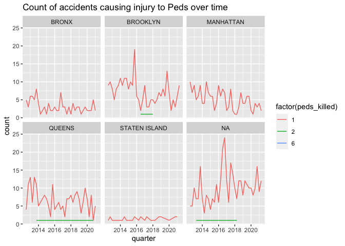

Exploration
================
Neeraj Sharma
5/24/2021

``` r
library(tidyverse)
library(here)
library(knitr)
library(ggthemes)
library(kableExtra)
library(lubridate)
library(scales)
```

``` r
crashes <- read_csv(here("Data", "Crashes.csv"))
person <- read_csv(here("Data", "Person.csv"))
vehicles <- read_csv(here("Data", "Vehicles.csv"))
priority_intersections <- read_csv(here("Data", "Priority_Intersections.csv"))
street_improvement_projects_intersections <- read_csv(here("Data", "SIP_Intersections.csv"))
```

Things I want to know now: \* Where has there been treatment for me to
do a diff-in-diff on? \* What different treatments have been done? \*
I’m not seeing great before/after visually.

## Where is the missing zip code info located?

In total there are 1233953 crashes with Zipcode information. This is
pretty good for a raw dataset 1.7 million crashes.

``` r
crashes %>%
  filter(is.na(`ZIP CODE`)) %>%
  group_by(`ON STREET NAME`) %>%
  count() %>%
  arrange(desc(n)) %>%
  head(10) %>%
  kable()
```

<table>

<thead>

<tr>

<th style="text-align:left;">

ON STREET NAME

</th>

<th style="text-align:right;">

n

</th>

</tr>

</thead>

<tbody>

<tr>

<td style="text-align:left;">

NA

</td>

<td style="text-align:right;">

124048

</td>

</tr>

<tr>

<td style="text-align:left;">

BELT PARKWAY

</td>

<td style="text-align:right;">

13622

</td>

</tr>

<tr>

<td style="text-align:left;">

LONG ISLAND EXPRESSWAY

</td>

<td style="text-align:right;">

9875

</td>

</tr>

<tr>

<td style="text-align:left;">

BROOKLYN QUEENS EXPRESSWAY

</td>

<td style="text-align:right;">

9747

</td>

</tr>

<tr>

<td style="text-align:left;">

GRAND CENTRAL PKWY

</td>

<td style="text-align:right;">

8507

</td>

</tr>

<tr>

<td style="text-align:left;">

FDR DRIVE

</td>

<td style="text-align:right;">

7359

</td>

</tr>

<tr>

<td style="text-align:left;">

CROSS BRONX EXPY

</td>

<td style="text-align:right;">

6128

</td>

</tr>

<tr>

<td style="text-align:left;">

MAJOR DEEGAN EXPRESSWAY

</td>

<td style="text-align:right;">

5904

</td>

</tr>

<tr>

<td style="text-align:left;">

CROSS ISLAND PARKWAY

</td>

<td style="text-align:right;">

5770

</td>

</tr>

<tr>

<td style="text-align:left;">

VAN WYCK EXPWY

</td>

<td style="text-align:right;">

5369

</td>

</tr>

</tbody>

</table>

## Where are most crashes located?

``` r
crashes %>%
  count(BOROUGH) %>%
  ggplot(aes(x = fct_reorder(BOROUGH, -n), y = n)) +
  geom_col() +
  scale_y_continuous(labels = comma)
```

<!-- -->

## What are the most dangerous intersections?

Most crashes take place on on the Parkways/expressways. I have removed
them here so we are just looking at actual intersections.

``` r
crashes %>% 
  group_by(`ON STREET NAME`, `CROSS STREET NAME`, `BOROUGH`) %>% 
  summarize(crash_count = n()) %>% 
  drop_na(`CROSS STREET NAME`) %>% 
  arrange(desc(crash_count)) %>% 
  head(10) %>% 
  kable()
```

<table>

<thead>

<tr>

<th style="text-align:left;">

ON STREET NAME

</th>

<th style="text-align:left;">

CROSS STREET NAME

</th>

<th style="text-align:left;">

BOROUGH

</th>

<th style="text-align:right;">

crash\_count

</th>

</tr>

</thead>

<tbody>

<tr>

<td style="text-align:left;">

ROCKAWAY BOULEVARD

</td>

<td style="text-align:left;">

BROOKVILLE BOULEVARD

</td>

<td style="text-align:left;">

NA

</td>

<td style="text-align:right;">

658

</td>

</tr>

<tr>

<td style="text-align:left;">

FLATBUSH AVENUE

</td>

<td style="text-align:left;">

GRAND ARMY PLAZA

</td>

<td style="text-align:left;">

NA

</td>

<td style="text-align:right;">

629

</td>

</tr>

<tr>

<td style="text-align:left;">

WEST FORDHAM ROAD

</td>

<td style="text-align:left;">

MAJOR DEEGAN EXPRESSWAY

</td>

<td style="text-align:left;">

BRONX

</td>

<td style="text-align:right;">

587

</td>

</tr>

<tr>

<td style="text-align:left;">

TILLARY STREET

</td>

<td style="text-align:left;">

FLATBUSH AVENUE EXTENSION

</td>

<td style="text-align:left;">

BROOKLYN

</td>

<td style="text-align:right;">

571

</td>

</tr>

<tr>

<td style="text-align:left;">

BRUCKNER BOULEVARD

</td>

<td style="text-align:left;">

EAST 138 STREET

</td>

<td style="text-align:left;">

NA

</td>

<td style="text-align:right;">

546

</td>

</tr>

<tr>

<td style="text-align:left;">

FLATBUSH AVENUE EXTENSION

</td>

<td style="text-align:left;">

TILLARY STREET

</td>

<td style="text-align:left;">

BROOKLYN

</td>

<td style="text-align:right;">

542

</td>

</tr>

<tr>

<td style="text-align:left;">

EAST 59 STREET

</td>

<td style="text-align:left;">

2 AVENUE

</td>

<td style="text-align:left;">

MANHATTAN

</td>

<td style="text-align:right;">

484

</td>

</tr>

<tr>

<td style="text-align:left;">

WEST 42 STREET

</td>

<td style="text-align:left;">

8 AVENUE

</td>

<td style="text-align:left;">

MANHATTAN

</td>

<td style="text-align:right;">

472

</td>

</tr>

<tr>

<td style="text-align:left;">

BRUCKNER BOULEVARD

</td>

<td style="text-align:left;">

HUNTS POINT AVENUE

</td>

<td style="text-align:left;">

BRONX

</td>

<td style="text-align:right;">

440

</td>

</tr>

<tr>

<td style="text-align:left;">

QUEENS BOULEVARD

</td>

<td style="text-align:left;">

WOODHAVEN BOULEVARD

</td>

<td style="text-align:left;">

QUEENS

</td>

<td style="text-align:right;">

428

</td>

</tr>

</tbody>

</table>

Let’s take ROCKAWAY BOULEVARD BROOKVILLE BOULEVARD and see how it has
changed over time.

``` r
crashes %>% 
  filter(`ON STREET NAME` == "ROCKAWAY BOULEVARD" & `CROSS STREET NAME` == "BROOKVILLE BOULEVARD") %>% 
  mutate(`CRASH DATE` = mdy(`CRASH DATE`)) %>% 
  group_by(month = floor_date(`CRASH DATE`, "quarter")) %>% 
  summarize(count = n()) %>% 
  ggplot(aes(x = month, y = count)) + 
  geom_line() + 
  labs(title = "Quarterly crashes at Rockaway/Brookville over time", x = "Date")
```

<!-- -->

``` r
top_causes_rockaway_brookville <- crashes %>% 
  filter(`ON STREET NAME` == "ROCKAWAY BOULEVARD" & `CROSS STREET NAME` == "BROOKVILLE BOULEVARD") %>% 
  count(`CONTRIBUTING FACTOR VEHICLE 1`) %>% 
  arrange(desc(n)) %>% 
  head(7) 

top_causes_rockaway_brookville %>% 
  ggplot(aes(x = fct_reorder(`CONTRIBUTING FACTOR VEHICLE 1`, -n), y = n)) +
  geom_col() +
  labs(title = "Top 7 causes of accident at Rockaway/Brookville over time")
```

<!-- -->

``` r
crashes %>% 
  filter(`ON STREET NAME` == "ROCKAWAY BOULEVARD" & `CROSS STREET NAME` == "BROOKVILLE BOULEVARD") %>% 
  mutate(`CRASH DATE` = mdy(`CRASH DATE`)) %>% 
  group_by(month = floor_date(`CRASH DATE`, "quarter"), `CONTRIBUTING FACTOR VEHICLE 1`) %>%
  summarize(count = n()) %>% 
  semi_join(top_causes_rockaway_brookville) %>% 
  ggplot(aes(x = month, y = count, color = `CONTRIBUTING FACTOR VEHICLE 1`)) + 
  geom_line()
```

<!-- -->

Let’s take a look at Manhattan’s most dangerous zone. EAST 59 STREET/2
AVENUE

``` r
crashes %>% 
  filter(`ON STREET NAME` == "EAST 59 STREET" & `CROSS STREET NAME` == "2 AVENUE") %>% 
  mutate(`CRASH DATE` = mdy(`CRASH DATE`)) %>% 
  group_by(month = floor_date(`CRASH DATE`, "quarter")) %>% 
  summarize(count = n()) %>% 
  ggplot(aes(x = month, y = count)) + 
  geom_line() + 
  labs(title = "Quarterly crashes at EAST 59 STREET/Brookville over time", x = "Date")
```

<!-- -->

``` r
top_causes_59_2 <- crashes %>% 
  filter(`ON STREET NAME` == "EAST 59 STREET" & `CROSS STREET NAME` == "2 AVENUE") %>% 
  count(`CONTRIBUTING FACTOR VEHICLE 1`) %>% 
  arrange(desc(n)) %>% 
  head(7) 

top_causes_59_2 %>% 
  ggplot(aes(x = fct_reorder(`CONTRIBUTING FACTOR VEHICLE 1`, -n), y = n)) +
  geom_col() +
  labs(title = "Top 7 causes of accident at EAST 59 STREET/2nd ave over time")
```

<!-- -->

``` r
crashes %>% 
  filter(`ON STREET NAME` == "EAST 59 STREET" & `CROSS STREET NAME` == "2 AVENUE") %>% 
  mutate(`CRASH DATE` = mdy(`CRASH DATE`)) %>% 
  group_by(month = floor_date(`CRASH DATE`, "quarter"), `CONTRIBUTING FACTOR VEHICLE 1`) %>%
  summarize(count = n()) %>% 
  semi_join(top_causes_59_2) %>% 
  ggplot(aes(x = month, y = count, color = `CONTRIBUTING FACTOR VEHICLE 1`)) + 
  geom_line()
```

<!-- -->

Specific intersections aren’t yielding enough for me. Let me do boroughs
broadly.

``` r
important_crash_reasons <- crashes %>%
  filter(`CONTRIBUTING FACTOR VEHICLE 1` != "Unspecified") %>% 
  count(`CONTRIBUTING FACTOR VEHICLE 1`) %>% 
  slice_max(`n`, n = 5)
            
crashes %>% 
  mutate(`CRASH DATE` = mdy(`CRASH DATE`)) %>% 
  group_by(quarter = floor_date(`CRASH DATE`, "quarter"), `BOROUGH`, `CONTRIBUTING FACTOR VEHICLE 1`) %>% 
  summarize(count = n()) %>% 
  semi_join(important_crash_reasons) %>% 
  ggplot(aes(x = quarter, y = count, color = `CONTRIBUTING FACTOR VEHICLE 1`)) + 
  geom_line() + 
  facet_wrap(~BOROUGH, scales = "free_y") +
  labs(title = "Number of Accidents by Cause Across Boroughs",
       subtitle = "2012 to Present",
       color = "Crash Reason",
       x = "Quarter", y = "Number of Accidents") +
  theme_bw() +
  theme(axis.text.x = element_text(angle = -25, hjust = 0), 
        plot.background = element_rect(fill = "lightblue"),
        plot.margin = margin(r = 2, unit = "cm"), 
        legend.position = "bottom") +
  guides(color=guide_legend(nrow=2,byrow=TRUE))
```

<!-- -->

Questions this creates for me: \* Do numbers go up in mid 2014 and stuff
because their data reporting became more complete or were there actually
more accidents as a result of those?

## Let’s hand calcualte some KSI’s for intersections

``` r
crashes %>%
  rename(date = `CRASH DATE`, time = `CRASH TIME`, borough = BOROUGH, 
         injured = `NUMBER OF PERSONS INJURED`, killed = `NUMBER OF PERSONS KILLED`, 
         main_factor = `CONTRIBUTING FACTOR VEHICLE 1`, vehicle_1 = `VEHICLE TYPE CODE 1`,
         street = `ON STREET NAME`, cross = `CROSS STREET NAME`) %>% 
  mutate(date = mdy(date)) %>%
  # filter(date < ymd(20151231)) %>% 
  group_by(street, cross, borough) %>% 
  summarize(count_inj = sum(injured), count_kill = sum(killed)) %>% 
  mutate(ksi = count_inj + count_kill) %>% 
  drop_na(cross, borough) %>% 
  arrange(desc(ksi)) %>% 
  ungroup() %>% 
  group_by(borough) %>% 
  mutate(ranking_in_borough = row_number(), 
         running_ksi = cumsum(ksi), 
         total_ksi_in_borough = sum(ksi, na.rm = TRUE),
         priority_area = if_else(running_ksi < 0.15*total_ksi_in_borough, 1, 0))
```

    ## # A tibble: 78,520 x 10
    ## # Groups:   borough [5]
    ##    street cross borough count_inj count_kill   ksi ranking_in_boro… running_ksi
    ##    <chr>  <chr> <chr>       <dbl>      <dbl> <dbl>            <int>       <dbl>
    ##  1 WEST … MAJO… BRONX         209          0   209                1         209
    ##  2 ATLAN… LOGA… BROOKL…       165          0   165                1         165
    ##  3 ROCKA… FARM… QUEENS        158          1   159                1         159
    ##  4 ROCKA… BREW… QUEENS        153          2   155                2         314
    ##  5 BRUCK… HUNT… BRONX         153          1   154                2         363
    ##  6 EAST … BRON… BRONX         142          0   142                3         505
    ##  7 3 AVE… 60 S… BROOKL…       136          0   136                2         301
    ##  8 LINDE… PENN… BROOKL…       134          0   134                3         435
    ##  9 PENNS… LIND… BROOKL…       133          0   133                4         568
    ## 10 EAST … EXTE… BRONX         132          0   132                4         637
    ## # … with 78,510 more rows, and 2 more variables: total_ksi_in_borough <dbl>,
    ## #   priority_area <dbl>

## Let us check how treatment is implimented?

Do we have strict exogeniety violations? We def have violations across
all million crashes/interventions, and then in the top most frequent
ones. But what about the intersections that are dangerous, but not that
dangerous? Does NYC truely go sequentially or just randomly fix, lets
say, the 50th to 150th most commonly dangerous intersections. If they
randomly fix, then we have satisfied strict exogeniety for that sample
and can test.

``` r
priority_intersections
```

    ## # A tibble: 293 x 5
    ##     LONG the_geom                                Street1  Street2            LAT
    ##    <dbl> <chr>                                   <chr>    <chr>            <dbl>
    ##  1 -74.0 POINT (-73.99280340951111 40.742910019… W 23 ST  AV OF THE AMERI…  40.7
    ##  2 -74.0 POINT (-73.98255629299412 40.731350134… E 14 ST  1 AV              40.7
    ##  3 -74.0 POINT (-73.98556874370907 40.757934524… W 45 ST  7 AV              40.8
    ##  4 -74.0 POINT (-73.98901118360183 40.718795529… LUDLOW … DELANCEY ST       40.7
    ##  5 -74.0 POINT (-73.99072636359251 40.755950404… W 40 ST  8 AV              40.8
    ##  6 -73.9 POINT (-73.94760500185852 40.825232859… W 145 ST AMSTERDAM AV      40.8
    ##  7 -74.0 POINT (-73.9914185853309 40.7448026820… W 26 ST  AV OF THE AMERI…  40.7
    ##  8 -74.0 POINT (-73.98656138491575 40.761660122… W 49 ST  8 AV              40.8
    ##  9 -74.0 POINT (-73.98978970704412 40.710093041… SOUTH ST RUTGERS SLIP      40.7
    ## 10 -74.0 POINT (-73.99683993951976 40.737360888… W 14 ST  AV OF THE AMERI…  40.7
    ## # … with 283 more rows

``` r
street_improvement_projects_intersections %>% 
  mutate(LONG = )
```

    ## # A tibble: 237 x 4
    ##    the_geom                       sip_year pjct_name              end_date      
    ##    <chr>                             <dbl> <chr>                  <chr>         
    ##  1 MULTIPOINT ((-73.903468781747…     2012 East New York Ave at … 11/15/2012 12…
    ##  2 MULTIPOINT ((-73.979993537971…     2018 Vanderbilt Ave at E 2… 12/19/2018 12…
    ##  3 MULTIPOINT ((-73.918702185268…     2014 46th Street and Queen… 07/28/2014 12…
    ##  4 MULTIPOINT ((-73.959432627318…     2016 St Marks Ave & Classo… 12/05/2016 12…
    ##  5 MULTIPOINT ((-73.968186877601…     2019 Lexington Ave and 59t… 03/31/2019 12…
    ##  6 MULTIPOINT ((-73.910813583388…     2016 Fulton St and Truxton… 01/01/2016 12…
    ##  7 MULTIPOINT ((-73.930355127005…     2019 University Ave, 165 S… 11/04/2019 12…
    ##  8 MULTIPOINT ((-73.974642244370…     2014 Ocean Parkway & Churc… 06/13/2014 12…
    ##  9 MULTIPOINT ((-73.872468341508…     2018 Lafayette Ave and Mor… 11/19/2018 12…
    ## 10 MULTIPOINT ((-73.953370175151…     2016 Fulton St and Bedford… 07/14/2016 12…
    ## # … with 227 more rows

## Gonna do some random regressions

``` r
cleaned_crashes <- crashes %>% 
  select(date = `CRASH DATE`, time = `CRASH TIME`, borough = BOROUGH, injured = `NUMBER OF PERSONS INJURED`,
         killed = `NUMBER OF PERSONS KILLED`, main_factor = `CONTRIBUTING FACTOR VEHICLE 1`, vehicle_1 = `VEHICLE TYPE CODE 1`) %>%
  mutate(manhattan = ifelse(borough == "MANHATTAN", 1, 0),
         brooklyn = ifelse(borough == "Brooklyn", 1, 0),
         bronx = ifelse(borough == "BRONX", 1, 0),
         staten = ifelse(borough == "STATEN ISLAND", 1, 0),
         queens = ifelse(borough == "QUEENS", 1, 0),
         )

cleaned_crashes %>%
  count(vehicle_1) %>% arrange(desc(n))
```

    ## # A tibble: 1,235 x 2
    ##    vehicle_1                                n
    ##    <chr>                                <int>
    ##  1 Sedan                               440400
    ##  2 PASSENGER VEHICLE                   416206
    ##  3 Station Wagon/Sport Utility Vehicle 351973
    ##  4 SPORT UTILITY / STATION WAGON       180291
    ##  5 Taxi                                 43982
    ##  6 4 dr sedan                           40037
    ##  7 TAXI                                 31911
    ##  8 Pick-up Truck                        28360
    ##  9 VAN                                  25266
    ## 10 OTHER                                22966
    ## # … with 1,225 more rows

``` r
# glm(injured ~ manhattan + bronx + staten + queens, family = "binomial", data = cleaned_crashes) %>% 
#   summary()
```

## Let’s merge all the data together and see what we can get?

Are the incident ID’s uniform?

``` r
# full_data <- inner_join(crashes, person, by = c("COLLISION_ID")) %>%
#   inner_join(vehicles %>% select(-VEHICLE_ID), by = c("COLLISION_ID"))
# 
# full_data %>% head(10)
```

## These are the graphs I made for the presentation deck

``` r
cleaned <- crashes %>%
  rename(date = `CRASH DATE`, time = `CRASH TIME`, borough = BOROUGH, 
         injured = `NUMBER OF PERSONS INJURED`, killed = `NUMBER OF PERSONS KILLED`, 
         main_factor = `CONTRIBUTING FACTOR VEHICLE 1`, vehicle_1 = `VEHICLE TYPE CODE 1`,
         street = `ON STREET NAME`, cross = `CROSS STREET NAME`) %>% 
  mutate(date = mdy(date))

cleaned %>% 
  drop_na(borough) %>% 
  group_by(borough, main_factor) %>% 
  summarize(count = n()) %>% 
  filter(main_factor != "Unspecified") %>% 
  slice_max(`count`, n = 5) %>% 
  ggplot(aes(x = fct_reorder(main_factor, -count), y = count)) +
  geom_col() +
  facet_wrap(~borough, scales = "free_x") + 
  labs(title = "Number of Accidents by Cause Across Boroughs",
       subtitle = "2012 to Present",
       x = "Cause of Collision", y = "Number of Accidents") +
  theme_bw() +
  theme(axis.text.x = element_text(angle = -25, hjust = 0), 
        plot.background = element_rect(fill = "lightblue"),
        plot.margin = margin(r = 2, unit = "cm"))
```

<!-- -->

``` r
main_factor_of_crashes_inBoroughs <- cleaned %>% 
  drop_na(borough) %>% 
  group_by(borough, main_factor) %>% 
  summarize(count = n()) %>% 
  filter(main_factor != "Unspecified") %>% 
  slice_max(`count`, n = 5) %>% 
  select(-count)

cleaned %>% 
  drop_na(borough) %>% 
  mutate(pre2015 = ifelse(date > ymd(20151231), "Post", "Pre")) %>%
  group_by(borough, main_factor, pre2015) %>% 
  summarize(count = n()) %>% 
  filter(main_factor != "Unspecified") %>% 
  inner_join(main_factor_of_crashes_inBoroughs) %>% 
  ggplot(aes(x = fct_reorder(main_factor, -count), y = count, fill = factor(pre2015, levels = c("Pre", "Post")))) +
  geom_col(position = "dodge2") +
  facet_wrap(~borough, scales = "free_x") + 
  labs(title = "Number of Accidents by Cause Across Boroughs",
       subtitle = "2012 to End 2015, 2016 to Present",
       x = "Cause of Collision", y = "Number of Accidents",
       fill = "Pre/Post 2015") +
  theme_bw() +
  theme(axis.text.x = element_text(angle = -25, hjust = 0), 
        plot.background = element_rect(fill = "lightblue"),
        plot.margin = margin(r = 2, unit = "cm"), 
        legend.position = c(0.95, 0.1))
```

<!-- -->

``` r
# street_improvement_projects_intersections %>%
#   mutate(the_geom = str_extract_all(the_geom, "\\([^()]+\\"))
  
  
  # mutate(LONG = str_extract_all(the_geom, "[0-9]+.[0-9]+")) %>% unnest()
```
