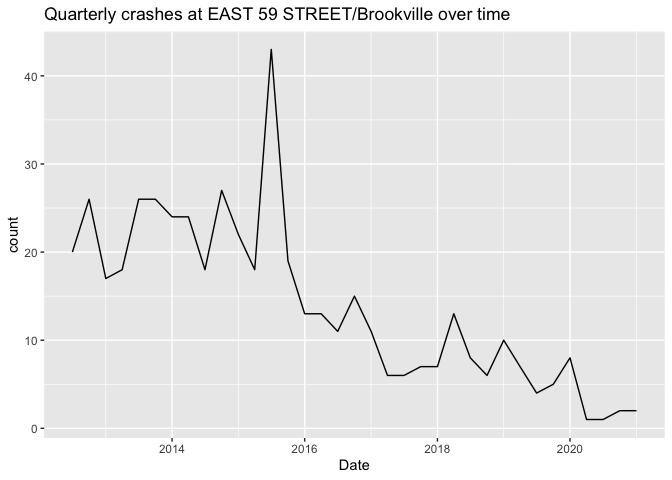

Exploration
================
Neeraj Sharma
5/24/2021

``` r
# Load necessary packages
library(tidyverse)
library(here)
library(knitr)
library(kableExtra)
library(lubridate)
library(scales)
```

``` r
# Load all our data in
crashes <- read_csv(here("Data", "Crashes.csv"))
person <- read_csv(here("Data", "Person.csv"))
vehicles <- read_csv(here("Data", "Vehicles.csv"))
```

Things I want to know now: \* Where has there been treatment for me to
do a diff-in-diff on? \* What different treatments have been done? \*
I’m not seeing great before/after visually.

## Where is the missing zip code info located?

In total there are 1233953 crashes with Zipcode information. This is
pretty good for a raw dataset 1.7 million crashes.

``` r
crashes %>%
  filter(is.na(`ZIP CODE`)) %>%
  group_by(`ON STREET NAME`) %>%
  count() %>%
  arrange(desc(n)) %>%
  head(10) %>%
  kable()
```

<table>

<thead>

<tr>

<th style="text-align:left;">

ON STREET NAME

</th>

<th style="text-align:right;">

n

</th>

</tr>

</thead>

<tbody>

<tr>

<td style="text-align:left;">

NA

</td>

<td style="text-align:right;">

124048

</td>

</tr>

<tr>

<td style="text-align:left;">

BELT PARKWAY

</td>

<td style="text-align:right;">

13622

</td>

</tr>

<tr>

<td style="text-align:left;">

LONG ISLAND EXPRESSWAY

</td>

<td style="text-align:right;">

9875

</td>

</tr>

<tr>

<td style="text-align:left;">

BROOKLYN QUEENS EXPRESSWAY

</td>

<td style="text-align:right;">

9747

</td>

</tr>

<tr>

<td style="text-align:left;">

GRAND CENTRAL PKWY

</td>

<td style="text-align:right;">

8507

</td>

</tr>

<tr>

<td style="text-align:left;">

FDR DRIVE

</td>

<td style="text-align:right;">

7359

</td>

</tr>

<tr>

<td style="text-align:left;">

CROSS BRONX EXPY

</td>

<td style="text-align:right;">

6128

</td>

</tr>

<tr>

<td style="text-align:left;">

MAJOR DEEGAN EXPRESSWAY

</td>

<td style="text-align:right;">

5904

</td>

</tr>

<tr>

<td style="text-align:left;">

CROSS ISLAND PARKWAY

</td>

<td style="text-align:right;">

5770

</td>

</tr>

<tr>

<td style="text-align:left;">

VAN WYCK EXPWY

</td>

<td style="text-align:right;">

5369

</td>

</tr>

</tbody>

</table>

## Where are most crashes located?

``` r
crashes %>%
  count(BOROUGH) %>%
  ggplot(aes(x = fct_reorder(BOROUGH, -n), y = n)) +
  geom_col() +
  scale_y_continuous(labels = comma)
```

<!-- -->

## What are the most dangerous intersections?

Most crashes take place on on the Parkways/expressways. I have removed
them here so we are just looking at actual intersections.

``` r
crashes %>% 
  group_by(`ON STREET NAME`, `CROSS STREET NAME`, `BOROUGH`) %>% 
  summarize(crash_count = n()) %>% 
  drop_na(`CROSS STREET NAME`) %>% 
  arrange(desc(crash_count)) %>% 
  head(10) %>% 
  kable()
```

<table>

<thead>

<tr>

<th style="text-align:left;">

ON STREET NAME

</th>

<th style="text-align:left;">

CROSS STREET NAME

</th>

<th style="text-align:left;">

BOROUGH

</th>

<th style="text-align:right;">

crash\_count

</th>

</tr>

</thead>

<tbody>

<tr>

<td style="text-align:left;">

ROCKAWAY BOULEVARD

</td>

<td style="text-align:left;">

BROOKVILLE BOULEVARD

</td>

<td style="text-align:left;">

NA

</td>

<td style="text-align:right;">

658

</td>

</tr>

<tr>

<td style="text-align:left;">

FLATBUSH AVENUE

</td>

<td style="text-align:left;">

GRAND ARMY PLAZA

</td>

<td style="text-align:left;">

NA

</td>

<td style="text-align:right;">

629

</td>

</tr>

<tr>

<td style="text-align:left;">

WEST FORDHAM ROAD

</td>

<td style="text-align:left;">

MAJOR DEEGAN EXPRESSWAY

</td>

<td style="text-align:left;">

BRONX

</td>

<td style="text-align:right;">

587

</td>

</tr>

<tr>

<td style="text-align:left;">

TILLARY STREET

</td>

<td style="text-align:left;">

FLATBUSH AVENUE EXTENSION

</td>

<td style="text-align:left;">

BROOKLYN

</td>

<td style="text-align:right;">

571

</td>

</tr>

<tr>

<td style="text-align:left;">

BRUCKNER BOULEVARD

</td>

<td style="text-align:left;">

EAST 138 STREET

</td>

<td style="text-align:left;">

NA

</td>

<td style="text-align:right;">

546

</td>

</tr>

<tr>

<td style="text-align:left;">

FLATBUSH AVENUE EXTENSION

</td>

<td style="text-align:left;">

TILLARY STREET

</td>

<td style="text-align:left;">

BROOKLYN

</td>

<td style="text-align:right;">

542

</td>

</tr>

<tr>

<td style="text-align:left;">

EAST 59 STREET

</td>

<td style="text-align:left;">

2 AVENUE

</td>

<td style="text-align:left;">

MANHATTAN

</td>

<td style="text-align:right;">

484

</td>

</tr>

<tr>

<td style="text-align:left;">

WEST 42 STREET

</td>

<td style="text-align:left;">

8 AVENUE

</td>

<td style="text-align:left;">

MANHATTAN

</td>

<td style="text-align:right;">

472

</td>

</tr>

<tr>

<td style="text-align:left;">

BRUCKNER BOULEVARD

</td>

<td style="text-align:left;">

HUNTS POINT AVENUE

</td>

<td style="text-align:left;">

BRONX

</td>

<td style="text-align:right;">

440

</td>

</tr>

<tr>

<td style="text-align:left;">

QUEENS BOULEVARD

</td>

<td style="text-align:left;">

WOODHAVEN BOULEVARD

</td>

<td style="text-align:left;">

QUEENS

</td>

<td style="text-align:right;">

428

</td>

</tr>

</tbody>

</table>

Let’s take ROCKAWAY BOULEVARD BROOKVILLE BOULEVARD and see how it has
changed over time.

``` r
crashes %>% 
  filter(`ON STREET NAME` == "ROCKAWAY BOULEVARD" & `CROSS STREET NAME` == "BROOKVILLE BOULEVARD") %>% 
  mutate(`CRASH DATE` = mdy(`CRASH DATE`)) %>% 
  group_by(month = floor_date(`CRASH DATE`, "quarter")) %>% 
  summarize(count = n()) %>% 
  ggplot(aes(x = month, y = count)) + 
  geom_line() + 
  labs(title = "Quarterly crashes at Rockaway/Brookville over time", x = "Date")
```

<!-- -->

``` r
top_causes_rockaway_brookville <- crashes %>% 
  filter(`ON STREET NAME` == "ROCKAWAY BOULEVARD" & `CROSS STREET NAME` == "BROOKVILLE BOULEVARD") %>% 
  count(`CONTRIBUTING FACTOR VEHICLE 1`) %>% 
  arrange(desc(n)) %>% 
  head(7) 

top_causes_rockaway_brookville %>% 
  ggplot(aes(x = fct_reorder(`CONTRIBUTING FACTOR VEHICLE 1`, -n), y = n)) +
  geom_col() +
  labs(title = "Top 7 causes of accident at Rockaway/Brookville over time")
```

<!-- -->

``` r
crashes %>% 
  filter(`ON STREET NAME` == "ROCKAWAY BOULEVARD" & `CROSS STREET NAME` == "BROOKVILLE BOULEVARD") %>% 
  mutate(`CRASH DATE` = mdy(`CRASH DATE`)) %>% 
  group_by(month = floor_date(`CRASH DATE`, "quarter"), `CONTRIBUTING FACTOR VEHICLE 1`) %>%
  summarize(count = n()) %>% 
  semi_join(top_causes_rockaway_brookville) %>% 
  ggplot(aes(x = month, y = count, color = `CONTRIBUTING FACTOR VEHICLE 1`)) + 
  geom_line()
```

<!-- -->

Let’s take a look at Manhattan’s most dangerous zone. EAST 59 STREET/2
AVENUE

``` r
crashes %>% 
  filter(`ON STREET NAME` == "EAST 59 STREET" & `CROSS STREET NAME` == "2 AVENUE") %>% 
  mutate(`CRASH DATE` = mdy(`CRASH DATE`)) %>% 
  group_by(month = floor_date(`CRASH DATE`, "quarter")) %>% 
  summarize(count = n()) %>% 
  ggplot(aes(x = month, y = count)) + 
  geom_line() + 
  labs(title = "Quarterly crashes at EAST 59 STREET/Brookville over time", x = "Date")
```

<!-- -->

``` r
top_causes_59_2 <- crashes %>% 
  filter(`ON STREET NAME` == "EAST 59 STREET" & `CROSS STREET NAME` == "2 AVENUE") %>% 
  count(`CONTRIBUTING FACTOR VEHICLE 1`) %>% 
  arrange(desc(n)) %>% 
  head(7) 

top_causes_59_2 %>% 
  ggplot(aes(x = fct_reorder(`CONTRIBUTING FACTOR VEHICLE 1`, -n), y = n)) +
  geom_col() +
  labs(title = "Top 7 causes of accident at EAST 59 STREET/2nd ave over time")
```

<!-- -->

``` r
crashes %>% 
  filter(`ON STREET NAME` == "EAST 59 STREET" & `CROSS STREET NAME` == "2 AVENUE") %>% 
  mutate(`CRASH DATE` = mdy(`CRASH DATE`)) %>% 
  group_by(month = floor_date(`CRASH DATE`, "quarter"), `CONTRIBUTING FACTOR VEHICLE 1`) %>%
  summarize(count = n()) %>% 
  semi_join(top_causes_59_2) %>% 
  ggplot(aes(x = month, y = count, color = `CONTRIBUTING FACTOR VEHICLE 1`)) + 
  geom_line()
```

<!-- -->

## Let’s merge all the data together and see what we can get?

Are the incident ID’s uniform?

``` r
full_data <- inner_join(crashes, person, by = c("COLLISION_ID")) %>%
  inner_join(vehicles %>% select(-VEHICLE_ID), by = c("COLLISION_ID"))

full_data %>% head(10)
```

    ## # A tibble: 10 x 72
    ##    `CRASH DATE` `CRASH TIME` BOROUGH `ZIP CODE` LATITUDE LONGITUDE LOCATION
    ##    <chr>        <time>       <chr>        <dbl>    <dbl>     <dbl> <chr>   
    ##  1 04/14/2021   05:32        <NA>            NA     NA        NA   <NA>    
    ##  2 04/14/2021   05:32        <NA>            NA     NA        NA   <NA>    
    ##  3 04/14/2021   05:32        <NA>            NA     NA        NA   <NA>    
    ##  4 04/14/2021   05:32        <NA>            NA     NA        NA   <NA>    
    ##  5 04/14/2021   05:32        <NA>            NA     NA        NA   <NA>    
    ##  6 04/14/2021   05:32        <NA>            NA     NA        NA   <NA>    
    ##  7 04/14/2021   05:32        <NA>            NA     NA        NA   <NA>    
    ##  8 04/14/2021   05:32        <NA>            NA     NA        NA   <NA>    
    ##  9 04/13/2021   21:35        BROOKL…      11217     40.7     -74.0 (40.683…
    ## 10 04/13/2021   21:35        BROOKL…      11217     40.7     -74.0 (40.683…
    ## # … with 65 more variables: `ON STREET NAME` <chr>, `CROSS STREET NAME` <chr>,
    ## #   `OFF STREET NAME` <chr>, `NUMBER OF PERSONS INJURED` <dbl>, `NUMBER OF
    ## #   PERSONS KILLED` <dbl>, `NUMBER OF PEDESTRIANS INJURED` <dbl>, `NUMBER OF
    ## #   PEDESTRIANS KILLED` <dbl>, `NUMBER OF CYCLIST INJURED` <dbl>, `NUMBER OF
    ## #   CYCLIST KILLED` <dbl>, `NUMBER OF MOTORIST INJURED` <dbl>, `NUMBER OF
    ## #   MOTORIST KILLED` <dbl>, `CONTRIBUTING FACTOR VEHICLE 1` <chr>,
    ## #   `CONTRIBUTING FACTOR VEHICLE 2` <chr>, `CONTRIBUTING FACTOR VEHICLE
    ## #   3` <chr>, `CONTRIBUTING FACTOR VEHICLE 4` <chr>, `CONTRIBUTING FACTOR
    ## #   VEHICLE 5` <chr>, COLLISION_ID <dbl>, `VEHICLE TYPE CODE 1` <chr>, `VEHICLE
    ## #   TYPE CODE 2` <chr>, `VEHICLE TYPE CODE 3` <chr>, `VEHICLE TYPE CODE
    ## #   4` <chr>, `VEHICLE TYPE CODE 5` <chr>, UNIQUE_ID.x <dbl>,
    ## #   CRASH_DATE.x <chr>, CRASH_TIME.x <time>, PERSON_ID <chr>,
    ## #   PERSON_TYPE <chr>, PERSON_INJURY <chr>, VEHICLE_ID <dbl>, PERSON_AGE <dbl>,
    ## #   EJECTION <chr>, EMOTIONAL_STATUS <chr>, BODILY_INJURY <chr>,
    ## #   POSITION_IN_VEHICLE <chr>, SAFETY_EQUIPMENT <chr>, PED_LOCATION <chr>,
    ## #   PED_ACTION <chr>, COMPLAINT <chr>, PED_ROLE <chr>,
    ## #   CONTRIBUTING_FACTOR_1.x <chr>, CONTRIBUTING_FACTOR_2.x <chr>,
    ## #   PERSON_SEX <chr>, UNIQUE_ID.y <dbl>, CRASH_DATE.y <chr>,
    ## #   CRASH_TIME.y <time>, STATE_REGISTRATION <chr>, VEHICLE_TYPE <chr>,
    ## #   VEHICLE_MAKE <chr>, VEHICLE_MODEL <chr>, VEHICLE_YEAR <dbl>,
    ## #   TRAVEL_DIRECTION <chr>, VEHICLE_OCCUPANTS <dbl>, DRIVER_SEX <chr>,
    ## #   DRIVER_LICENSE_STATUS <chr>, DRIVER_LICENSE_JURISDICTION <chr>,
    ## #   PRE_CRASH <chr>, POINT_OF_IMPACT <chr>, VEHICLE_DAMAGE <chr>,
    ## #   VEHICLE_DAMAGE_1 <chr>, VEHICLE_DAMAGE_2 <chr>, VEHICLE_DAMAGE_3 <chr>,
    ## #   PUBLIC_PROPERTY_DAMAGE <chr>, PUBLIC_PROPERTY_DAMAGE_TYPE <chr>,
    ## #   CONTRIBUTING_FACTOR_1.y <chr>, CONTRIBUTING_FACTOR_2.y <chr>
